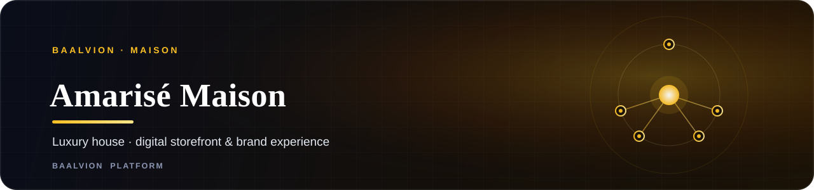

<div align="center">
  
</div>

<div align="center">

<br/>

**Amarisé Maison Avenue** — the digital storefront and brand experience for the Amarisé luxury house.

<br/>

[](https://amarisemaisonavenue.com)
[](https://nextjs.org)
[](https://www.typescriptlang.org)
[](https://tailwindcss.com)

<sub><a href="#overview">Overview</a> · <a href="#tech-stack">Tech stack</a> · <a href="#getting-started">Getting started</a> · <a href="#project-structure">Structure</a> · <a href="#deployment">Deployment</a></sub>

</div>

---

## Overview

**Amarisé Maison** is a luxury house. This repository is its **digital storefront and brand
experience** — an editorial, conversion-minded presentation of the maison and its collections. It is
one of the consumer-facing brands in the
[Baalvion platform](https://github.com/baalvionservice/Baalvion-Project-Infra).

> One identity. One platform. Every market.

**Live:** [amarisemaisonavenue.com](https://amarisemaisonavenue.com)

## Tech stack

| Layer | Technology |
| :--- | :--- |
| Framework | **Next.js** (App Router) |
| Language | **TypeScript** |
| Styling | **Tailwind CSS** + PostCSS |
| Components | **shadcn/ui** (`components.json`) |
| Hosting | **Firebase App Hosting** (`apphosting.yaml`) |
| SEO | see [`SEO_UPDATES_SUMMARY.md`](SEO_UPDATES_SUMMARY.md) |

## Getting started

```bash
# install dependencies (pnpm — see pnpm-lock.yaml)
pnpm install

# start the dev server (Next.js, http://localhost:3000)
pnpm dev

# production build & start
pnpm build
pnpm start
```

> Uses the standard Next.js script set (`dev` / `build` / `start` / `lint`).

## Project structure

```
.
├── docs/                # project documentation
├── next.config.ts       # Next.js configuration
├── tailwind.config.ts   # Tailwind theme & tokens
├── postcss.config.mjs   # PostCSS pipeline
├── components.json      # shadcn/ui component registry
├── tsconfig.json        # TypeScript configuration
├── apphosting.yaml      # Firebase App Hosting config
└── SEO_UPDATES_SUMMARY.md
```

## Deployment

Deployed via **Firebase App Hosting** — configuration lives in [`apphosting.yaml`](apphosting.yaml).
Pushes to the production branch roll out to [amarisemaisonavenue.com](https://amarisemaisonavenue.com).

---

<div align="center">

<sub>Part of the <a href="https://github.com/baalvionservice">Baalvion Industries</a> platform · © 2025–2026 <b>Baalvion Industries Private Limited</b> · CIN U43121OD2025PTC048479 · India</sub>

</div>
